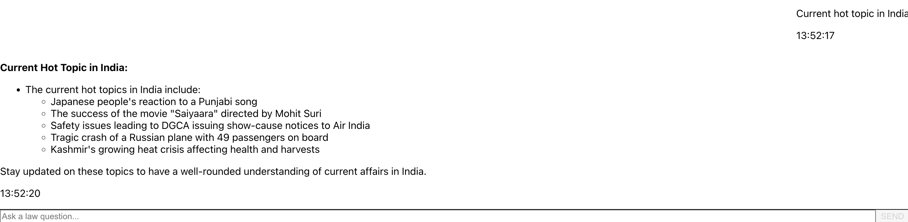

# Personal Coaching Autonomous Law Exam Agent 🎓⚖️

A comprehensive AI-powered coaching assistant for CLAT (Common Law Admission Test) preparation, built with LangGraph autonomous agents and modern web technologies.

## 🌟 Features

### 🤖 Intelligent AI Agent
- **Autonomous LangGraph Agent**: Advanced reasoning with planning, execution, and response generation
- **Multi-Tool Integration**: Web search, document retrieval, and practice question generation
- **Session Memory**: Persistent conversation history and learning progress tracking
- **Adaptive Learning**: Personalized coaching based on user performance

### 📚 Learning Capabilities
- **Interactive Practice Sessions**: Topic-specific multiple choice questions
- **Progress Tracking**: Detailed analytics on learning performance
- **Comprehensive Coverage**: Constitutional law, contract law, tort law, and more
- **Explanatory Responses**: Detailed explanations for better understanding

### 💻 Modern Web Interface
- **React Frontend**: Clean, responsive chat interface with markdown support
- **Real-time Communication**: FastAPI backend with WebSocket-like experience
- **Mobile-Friendly**: Optimized for all device sizes
- **Rich Formatting**: Proper rendering of questions, options, and explanations

## 🏗️ Architecture

```
law-exam-agent/
├── backend/                    # Python FastAPI backend
│   ├── agents/                # AI agent implementations
│   │   ├── autonomous_langgraph_agent.py    # Main LangGraph agent
│   │   └── agent_factory.py               # Agent selection logic
│   ├── tools/                 # Agent tools and capabilities
│   ├── database/              # SQLAlchemy models and CRUD operations
│   ├── retrievers/            # Vector store and document retrieval
│   ├── evaluation/            # Agent performance evaluation
│   └── main.py               # FastAPI application entry point
└── frontend/                  # React.js frontend
    ├── src/
    │   ├── ChatInterface.jsx  # Main chat component with markdown support
    │   ├── apiService.js      # Backend API communication
    │   └── App.jsx           # Application root
    └── package.json          # Dependencies including react-markdown
```

## 🚀 Quick Start

### Prerequisites

- **Python 3.8+** with pip
- **Node.js 16+** with npm
- **Ollama** (for local LLM) or **OpenAI API key**
- **Google Serper API key** (for web search)

### Setup and Run

```bash
# Clone the repository
git clone <repository-url>
cd law-exam-agent

# First-time setup (creates venv, installs all dependencies)
make setup

# Configure environment (copy and edit .env file)
cp backend/.env.example backend/.env
# Edit backend/.env with your API keys

# Start both backend and frontend servers
make start
```

### Environment Configuration

Edit `backend/.env`:

```env
# For local Ollama setup
LLM_PROVIDER=ollama
LLM_MODEL=llama3.1
LLM_HOST=http://localhost:11434

# For OpenAI setup
LLM_PROVIDER=openai
LLM_MODEL=gpt-4
LLM_PROVIDER_API_KEY=sk-your-openai-api-key

# Required for web search
GOOGLE_SERPER_API_KEY=your_google_serper_api_key

# Agent configuration
AGENT_NAME=AutonomousLangGraphAgent
TOOL_SCHEMA_VALIDATION=true
```

### Available Makefile Commands

- `make setup` - Complete setup for new developers (creates venv + installs dependencies)
- `make start` - Start both backend and frontend servers
- `make start-backend` - Start only the backend server (with venv activated)
- `make start-frontend` - Start only the frontend server
- `make stop` - Stop all running servers
- `make help` - Show all available commands

### Access the Application

Open your browser and navigate to:
- **Frontend**: http://localhost:5173
- **Backend API**: http://localhost:8000
- **API Docs**: http://localhost:8000/docs

## 🎯 Usage Examples




## 🛠️ Technical Stack

### Backend
- **FastAPI**: Modern Python web framework
- **LangGraph**: Advanced agent orchestration
- **LangChain**: LLM integration and tooling
- **SQLAlchemy**: Database ORM
- **ChromaDB**: Vector database for document retrieval
- **Sentence Transformers**: Text embeddings

### Frontend
- **React 19**: Modern frontend framework
- **Vite**: Fast build tool and dev server
- **Tailwind CSS**: Utility-first styling
- **React Markdown**: Rich text rendering
- **Axios**: HTTP client

### AI/ML
- **Ollama**: Local LLM hosting
- **OpenAI GPT**: Cloud LLM option
- **HuggingFace Transformers**: Embedding models


## 🔧 Configuration Options

### LLM Providers
- **Ollama** (local): Free, private, customizable
- **OpenAI**: High-quality, cloud-based

### Vector Stores
- **ChromaDB**: Default, lightweight

### Agent Types
- **AutonomousLangGraphAgent**: Advanced reasoning with tools
- Other agents which you see under agents are for learning purpose and about learning experience you can go through the learning_experience document.

## 📊 Evaluation & Monitoring

The system includes comprehensive evaluation capabilities: Evaluation is not there for AutonomousLangGraphAgent. It also uses Langsmith.

```bash
# Run agent evaluation
cd backend
python -m evaluation.run_evaluation

# View results
python -m evaluation.utils.results_analyzer
```

### Metrics Tracked
- **Correctness**: Answer accuracy
- **Tool Selection**: Appropriate tool usage
- **Relevance**: Response relevance to questions
- **Memory Retention**: Session continuity

## Observability 

**LangSmith** based observability


## 🔍 API Endpoints

### Chat Interface
```http
POST /chat
Content-Type: application/json

{
  "user_id": "user1",
  "question": "Explain tort law",
  "session_id": "default"
}
```

## 📝 License

This project is licensed under the MIT License - see the [LICENSE](LICENSE) file for details.


### Getting Help

- **Issues**: Open a GitHub issue with detailed description
- **Discussions**: Use GitHub Discussions for questions
- **Documentation**: Check inline code documentation

**Built with ❤️ for CLAT aspirants**

*Empowering the next generation of legal professionals through AI-powered education*